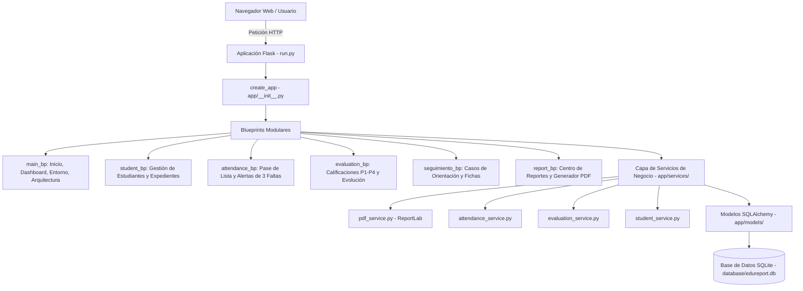

# EduReport

Sistema Web de Gestión Académica, Control de Asistencia y Generación Automatizada de Reportes Escolares Oficiales para el Nivel Secundario del Ministerio de Educación de la República Dominicana (MINERD).

> ### 🌐 ENLACE AL DESPLIEGUE FUNCIONAL EN LA NUBE (Render):
> 🚀 **Aplicación en Vivo:** [https://edureport-gestion-docente-y-automatizacion.onrender.com](https://edureport-gestion-docente-y-automatizacion.onrender.com) *(o la URL de tu servicio web en Render)*
>
> ### 💻 ENLACES PARA EJECUCIÓN LOCAL:
> - 🏠 **Página Principal:** [http://127.0.0.1:5000/](http://127.0.0.1:5000/)
> - 📊 **Dashboard Académico:** [http://127.0.0.1:5000/dashboard](http://127.0.0.1:5000/dashboard)
> - 👥 **Estudiantes y Expedientes:** [http://127.0.0.1:5000/estudiantes/](http://127.0.0.1:5000/estudiantes/)
> - 📅 **Pase de Lista (Asistencia):** [http://127.0.0.1:5000/asistencia/registrar](http://127.0.0.1:5000/asistencia/registrar)
> - 📝 **Evaluaciones (4 Calificaciones Ord. + 4 RP):** [http://127.0.0.1:5000/evaluaciones/registrar](http://127.0.0.1:5000/evaluaciones/registrar)
> - 📄 **Generador de Reportes en PDF:** [http://127.0.0.1:5000/reportes/](http://127.0.0.1:5000/reportes/)
> - ⚙️ **Consola del Entorno (Antigravity):** [http://127.0.0.1:5000/entorno](http://127.0.0.1:5000/entorno)
>
> *(Al usar **Go Live** dentro de Google Antigravity, se abrirá el lanzador automático index.html que redirige directamente a la app).*

---


## Descripción

**EduReport** es una aplicación web moderna, intuitiva y robusta construida con Python y Flask. Su propósito es acompañar a los equipos docentes, directivos, orientadores y coordinadores pedagógicos en el registro cotidiano de la vida escolar.

El sistema contempla la estructura oficial del Nivel Secundario en República Dominicana:
- **Primer Ciclo:** 1.º, 2.º y 3.º de Secundaria.
- **Segundo Ciclo:** 4.º, 5.º y 6.º de Secundaria.

EduReport resuelve la gestión integral de expedientes estudiantiles, el pase de lista diario con la regla institucional de alerta temprana por ausencias acumuladas, el registro de calificaciones en escala de 0 a 100 con períodos P1, P2, P3 y P4, planes de recuperación pedagógica (RP), seguimiento psicosocial y la emisión instantánea de informes formales listos para imprimir o descargar en formato PDF oficial.

---

## Problema

En muchos centros educativos públicos y privados, la administración escolar y el registro docente se enfrentan a desafíos recurrentes:

1. **Dispersión de la información:** Las listas de estudiantes, las hojas de asistencia en papel y los libros de notas suelen estar aislados, dificultando el cruce de datos.
2. **Detección tardía del ausentismo:** Los estudiantes que faltan de forma reiterada a clases suelen ser identificados cuando el daño pedagógico ya es grave o cuando han reprobado por inasistencia.
3. **Sobrecarga burocrática:** Los docentes invierten decenas de horas redactando manualmente informes de seguimiento, cartas para padres y fichas de avance pedagógico.
4. **Falta de uniformidad:** Cada profesor elabora documentos con formatos dispares que carecen de los estándares institucionales requeridos por los Distritos y Regionales Educativas.

---

## Objetivo

Diseñar e implementar una plataforma web ágil, segura y amigable que:
- Centralice los expedientes de los estudiantes de 1.º a 6.º de Secundaria con sus familiares/tutores y datos de contacto.
- Automatice el pase de lista diario bajo los estados oficiales **Presente (P)**, **Tardanza (T)**, **Ausencia (A)** y **Excusa (E)**.
- Active alertas tempranas automáticas al alcanzar **3 ausencias acumuladas**, vinculándolas a un informe de seguimiento inmediato.
- Administre las calificaciones curriculares por períodos (P1 a P4) y recuperación pedagógica (RP) con visualización de la evolución del estudiante.
- Genere informes oficiales profesionales en PDF estructurados con encabezado institucional, datos de la escuela, desarrollo pedagógico (situación, análisis, acciones, recomendaciones, conclusión) y espacios para firmas.

---

## Usuarios

EduReport está diseñado pensando en diferentes roles de la comunidad escolar:

1. **Docentes de Asignatura y Tutores de Aula:**
   - Realizan el pase de lista diario en segundos desde cualquier dispositivo.
   - Registran calificaciones parciales y planes de recuperación.
   - Emiten informes de rendimiento y conducta con un solo clic.

2. **Equipo de Orientación y Psicología:**
   - Monitorean a los estudiantes con alertas activas por ausentismo o bajo rendimiento.
   - Crean y consultan expedientes de seguimiento psicosocial y acuerdos con las familias.

3. **Equipo Directivo y Coordinación Pedagógica:**
   - Supervisan las métricas globales del centro educativo desde el Dashboard en tiempo real.
   - Avalan y firman los reportes oficiales generados por el centro.

4. **Padres, Madres y Tutores Legales:**
   - Reciben informes claros, transparentes y estructurados sobre la trayectoria de sus hijos.

---

## Funcionalidades

### 1. Módulo de Estudiantes
- **Listar:** Vista tabular con paginación, filtros por Ciclo, Grado, Sección y búsqueda rápida.
- **Buscar:** Búsqueda en tiempo real por nombres, apellidos o RNE/matrícula.
- **Consultar:** Expediente individual con datos personales, familiares/tutores, historial y gráfico de progreso.
- **Agregar / Editar:** Formulario completo para registrar nombre, apellido, sexo, RNE, grado, sección, ciclo, condición inicial, familiar y teléfono.
- **Eliminar:** Borrado seguro con confirmación y verificación de dependencias.

### 2. Módulo de Asistencia (Regla de las 3 Ausencias)
- Pase de lista diario ágil por sección con botones de selección rápida (P, T, A, E).
- Cálculo automático de totales de presentes, tardanzas, ausencias, excusas y porcentaje de asistencia efectiva.
- **Regla EduReport:** Al acumular **3 ausencias**, el sistema activa una alerta visual destacada en rojo, lista al estudiante en el Dashboard y genera el informe de seguimiento de asistencia con datos reales.

### 3. Módulo de Evaluación Académica
- Registro de calificaciones en escala de 0 a 100 puntos por estudiante, asignatura y período (P1, P2, P3, P4).
- Vinculación con competencias fundamentales, indicadores de logro y evidencias.
- Soporte para **Recuperación Pedagógica (RP)** donde la nota final refleja la calificación recuperada.
- Gráfico interactivo que muestra la evolución del estudiante entre los períodos escolares.

### 4. Módulo de Seguimiento Psicosocial y Orientación
- Ficha de intervención y acompañamiento escolar.
- Registro de citas, acuerdos con padres/tutores y compromisos de asistencia.
- Gestión de estados de casos: Abierto, En Seguimiento, Resuelto.

### 5. Generación de Reportes y Descarga de PDF
- Centro de reportes con selección de tipo: Asistencia, Avance Académico, Bajo Rendimiento, Progreso, Reconocimiento Positivo y Seguimiento Integral.
- Generador con editor de borrador previo para que el docente agregue observaciones antes de imprimir.
- **Exportación en PDF profesional con ReportLab** listo para imprimir, con formato oficial del MINERD.

---

## Tecnologías

- **Lenguaje de Programación:** Python 3.10+ (versátil, legible y potente).
- **Framework Web Backend:** Flask 3.0.3 (arquitectura modular, Blueprints y Application Factory).
- **Capa de Datos y ORM:** Flask-SQLAlchemy 3.1.1 con SQLite como motor de base de datos relacional local sin configuraciones complejas.
- **Generación de Documentos PDF:** ReportLab 5.0.1 (maquetación precisa de documentos de calidad editorial).
- **Procesamiento de Imágenes y Assets:** Pillow 12.3.0.
- **Frontend y Diseño:** HTML5 semántico, CSS3 Vanilla con variables y efectos dinámicos, Bootstrap 5.3 y Bootstrap Icons 1.11.3.
- **Visualización de Datos:** Chart.js para gráficos de asistencia y barras comparativas.
- **Entorno y Pruebas:** Pytest y Unittest para pruebas automatizadas completas.

---

## Arquitectura

El sistema implementa el patrón **Application Factory** complementado con **Blueprints modulares**:



Esta separación en capas garantiza que la lógica de cálculo (alertas, promedios) resida en los servicios y que las rutas solo se encarguen de coordinar las respuestas web.

---

## Estructura del proyecto

```text
EduReport/
│
├── app/                           # Código fuente principal de la aplicación Flask
│   ├── __init__.py                # Fábrica de aplicaciones (create_app) y registro de Blueprints
│   ├── models/                    # Modelos de datos de SQLAlchemy
│   │   ├── __init__.py            # Exportación centralizada de modelos
│   │   ├── academic.py            # CentroEducativo, Aula/Sección, Ciclo, Grado, Estudiante
│   │   ├── attendance.py          # Asistencia (P/T/A/E) y códigos de estado
│   │   └── evaluation.py          # Asignaturas, Competencias, Evaluaciones, Reportes, Seguimientos
│   ├── routes/                    # Controladores web (Blueprints)
│   │   ├── main_routes.py         # /, /dashboard, /entorno, /arquitectura
│   │   ├── student_routes.py      # CRUD de estudiantes y expedientes
│   │   ├── attendance_routes.py   # Pase de lista, resumen y bandeja de alertas
│   │   ├── evaluation_routes.py   # Registro de calificaciones y cuadro de notas
│   │   ├── seguimiento_routes.py  # Fichas de intervención y orientación
│   │   └── report_routes.py       # Centro de reportes y descarga de PDF
│   ├── services/                  # Lógica de negocio independiente de la web
│   │   ├── __init__.py            # Exportaciones de servicios
│   │   ├── student_service.py     # Consultas y filtros de estudiantes
│   │   ├── attendance_service.py  # Estadísticas de asistencia y Regla de 3 Ausencias
│   │   ├── evaluation_service.py  # Cálculo de promedios, aprobados y recuperación
│   │   ├── seguimiento_service.py # Creación de seguimientos y almacenamiento de reportes
│   │   ├── pdf_service.py         # Generación editorial de PDF oficiales con ReportLab
│   │   └── seed_service.py        # Poblado automático con registros oficiales del centro
│   ├── static/                    # Archivos públicos de diseño
│   │   ├── css/style.css          # Estilos personalizados, tarjetas modernas y animaciones
│   │   ├── js/main.js             # Lógica del cliente, validaciones y filtros
│   │   └── img/logo_minerd.png    # Escudo y logo institucional oficial
│   └── templates/                 # Plantillas HTML con motor Jinja2
│       ├── base.html              # Plantilla base con barra de navegación y pie de página
│       ├── dashboard.html         # Panel principal interactivo con métricas y gráficos
│       ├── index.html             # Página de bienvenida e información del sistema
│       ├── environment.html       # Visualizador de estado del servidor y base de datos
│       ├── arquitectura.html      # Documentación visual de arquitectura
│       ├── students/              # Vistas de listar, crear, editar y consultar estudiantes
│       ├── attendance/            # Vistas de pase de lista y bandeja de alertas
│       ├── evaluation/            # Vistas de calificaciones y evolución
│       ├── seguimiento/           # Vistas de intervenciones de orientación
│       └── reports/               # Vistas de generación, vista previa e impresión
│
├── database/                      # Directorio que almacena el archivo local SQLite
├── docs/                          # Documentación didáctica y técnica
│   ├── tutorial.md                # Guía paso a paso para personas que inician a programar
│   ├── arquitectura.md            # Explicación conceptual para principiantes
│   ├── plan.md                    # Plan de trabajo integral de 14 puntos
│   └── images/                    # Diagramas e imágenes de arquitectura
│
├── tests/                         # Suite de pruebas automatizadas
│   ├── test_edureport_core.py     # 9 pruebas obligatorias de verificación del sistema
│   ├── test_basic.py              # Pruebas básicas de inicio y respuesta HTTP
│   ├── test_database.py           # Pruebas de modelos relacionales e integridad
│   └── test_students.py           # Pruebas exhaustivas del módulo de estudiantes
├── EduReport_Analisis_y_Demostracion.ipynb  # Cuaderno Jupyter de análisis de datos y validación de reglas
├── config.py                      # Configuración de entornos (development, testing, production)
├── wsgi.py                        # Punto de entrada WSGI para producción (Gunicorn / Render)
├── Procfile                       # Comando de arranque para despliegue en Render
├── render.yaml                    # Configuración de infraestructura como código para Render
├── requirements.txt               # Dependencias Python fijadas y verificadas
├── runtime.txt                    # Versión de Python especificada para Render (3.11.9)
├── run.py                         # Archivo ejecutable para iniciar el servidor localmente
└── README.md                      # Este documento
```

---

## Instalación

Para instalar EduReport en tu computadora, asegúrate de tener instalado **Python 3.10 o superior** y **Git**.

### Paso 1: Clonar el proyecto desde GitHub
Abre tu terminal (PowerShell o CMD en Windows, Terminal en Linux/macOS) y escribe:
```bash
git clone https://github.com/usuario/EduReport.git
```

### Paso 2: Entrar a la carpeta del proyecto
```bash
cd EduReport
```

---

## Entorno virtual

Un entorno virtual es una carpeta aislada donde se instalan los paquetes de Python de este proyecto sin alterar el resto de tu computadora.

### En Windows (PowerShell):
```powershell
python -m venv .venv
.\.venv\Scripts\Activate.ps1
```
*(Si PowerShell te muestra un mensaje sobre políticas de ejecución de scripts, puedes escribir: `Set-ExecutionPolicy -Scope Process -ExecutionPolicy Bypass` y volver a intentar).*

### En Linux / macOS:
```bash
python3 -m venv .venv
source .venv/bin/activate
```

Sabrás que está activado porque verás `(.venv)` al inicio de tu línea de comandos.

### Instalar dependencias
Con el entorno virtual activado, ejecuta:
```bash
pip install -r requirements.txt
```

---

## Ejecución

Para iniciar el servidor web de EduReport, simplemente corre:
```bash
python run.py
```

Verás un mensaje similar a este:
```text
 * Running on http://127.0.0.1:5000 (Press CTRL+C to quit)
 * Restarting with stat
 * Debugger is active!
```

---

## Uso de la aplicación

1. Abre tu navegador favorito (Chrome, Edge, Firefox, Safari) e ingresa a:
   ```text
   http://127.0.0.1:5000
   ```
2. **Navegación principal:**
   - **Inicio (`/`):** Presentación del centro escolar, directrices curriculares y módulos.
   - **Dashboard (`/dashboard`):** Resumen visual con total de estudiantes, alertas por ausentismo, promedio académico y gráficos.
   - **Estudiantes (`/estudiantes`):** Registro, consulta de expedientes, filtros por ciclo (1.º a 6.º) y búsqueda por RNE.
   - **Asistencia (`/asistencia`):** Pase de lista diario por aula seleccionando fecha y estado (P/T/A/E).
   - **Alertas (`/asistencia/alertas`):** Estudiantes que han alcanzado 3 ausencias acumuladas con botón directo a informe.
   - **Evaluaciones (`/evaluaciones`):** Registro de notas en escala 0-100, asignación a períodos P1-P4 y recuperación pedagógica.
   - **Seguimiento (`/seguimiento`):** Casos de orientación y acuerdos con familias.
   - **Reportes (`/reportes`):** Centro de emisión de documentos y descarga en PDF.
   - **Entorno (`/entorno`):** Auditoría técnica en vivo del estado de la base de datos y tablas.

---

## Generación de reportes

EduReport cuenta con un motor de informes institucionales que combina datos reales de la base de datos con formatos aprobados:

1. **Tipos de Reportes Disponibles:**
   - **Seguimiento de Asistencia:** Se genera automáticamente al activarse la alerta de 3 ausencias, detallando fechas de faltas y citaciones.
   - **Avance Académico:** Calificaciones obtenidas por período (P1, P2, P3, P4) y promedio general.
   - **Bajo Rendimiento:** Identificación de materias con nota menor a 70 puntos y plan de recuperación.
   - **Progreso Académico:** Evolución del estudiante y tendencia de mejora entre períodos.
   - **Reconocimiento Positivo:** Certificado de honor para estudiantes destacados en asistencia y notas.
   - **Seguimiento Integral:** Visión 360° combinando asistencia, calificaciones e historial de orientación.

2. **Flujo de 3 Pasos del Generador:**
   - **Paso 1 (Parámetros):** Selecciona el tipo de informe, el estudiante, la asignatura y el período.
   - **Paso 2 (Vista previa y Borrador):** El sistema redacta un borrador fáctico basado en datos reales que el docente puede enriquecer o editar libremente.
   - **Paso 3 (PDF Oficial):** Con el botón **"Descargar PDF Oficial"**, el sistema genera en tiempo real con **ReportLab** un documento formal que incluye:
     - Encabezado institucional de la República Dominicana y MINERD.
     - Logo y datos del centro (Regional, Distrito, Año Escolar).
     - Datos del estudiante, RNE, grado, sección y contacto del tutor.
     - Cuerpo estructurado en 5 partes: **I. Situación**, **II. Análisis**, **III. Acciones**, **IV. Recomendaciones** y **V. Conclusión**.
     - Cuadro con 4 espacios para firmas (Docente, Orientación, Dirección y Tutor).

---

## Pruebas

EduReport cuenta con una suite completa de pruebas automatizadas para verificar que todo funcione al 100%.

### Ejecutar las 9 pruebas mínimas obligatorias:
```bash
python -m unittest tests/test_edureport_core.py
```

Estas pruebas verifican formalmente:
1. La aplicación Flask inicia correctamente.
2. La página principal responde con código 200 OK.
3. Se puede crear un estudiante con todos sus datos.
4. Se puede consultar el expediente de un estudiante.
5. Se puede registrar asistencia (P/T/A/E).
6. Tres ausencias acumuladas activan la alerta oficial.
7. Se puede registrar una evaluación con escala 0-100 y recuperación pedagógica.
8. Se puede generar un reporte y guardarlo en la base de datos.
9. Se puede generar un archivo PDF profesional con ReportLab.

### Ejecutar todas las pruebas con pytest:
```bash
pytest
```
*Todas las 26 pruebas del proyecto pasan exitosamente.*

---

## GitHub

Para colaborar y subir cambios a GitHub:

1. **Inicializar repositorio y añadir archivos:**
   ```bash
   git add .
   git commit -m "feat: implementacion completa de EduReport con ReportLab y pruebas"
   ```
2. **Subir a tu repositorio remoto:**
   ```bash
   git branch -M main
   git remote add origin https://github.com/tu-usuario/EduReport.git
   git push -u origin main
   ```
3. El archivo `.gitignore` incluido en el proyecto ya excluye automáticamente la carpeta `.venv`, archivos compilados `.pyc`, la base de datos temporal y caché.

---

## Despliegue

EduReport está preparado para ser desplegado fácilmente en diferentes entornos:

1. **Despliegue Funcional en la Nube (Render):**
   - **Enlace de la Aplicación en Vivo:** [https://edureport-gestion-docente-y-automatizacion.onrender.com](https://edureport-gestion-docente-y-automatizacion.onrender.com)
   - El proyecto incluye los archivos oficiales para Render:
     - `Procfile`: `web: gunicorn wsgi:app`
     - `render.yaml`: Especificación de servicio web Python en plan gratuito con variables de entorno automáticas (`SECRET_KEY`, `FLASK_ENV=production`, `PYTHON_VERSION=3.11.9`).
     - `runtime.txt`: Especifica la versión estable de Python `python-3.11.9`.
     - `wsgi.py`: Entrada limpia que desacopla la inicialización de la app evitando bloqueos de importación circular.

2. **Despliegue Local o en Red Escolar (LAN):**
   - Al ejecutar `python run.py`, la aplicación escucha en `0.0.0.0:5000`. Cualquier computadora o tableta conectada a la misma red WiFi del liceo puede acceder mediante la IP local (por ejemplo `http://192.168.1.100:5000`).

3. **Despliegue en Servidores Linux (VPS / Cloud):**
   - Con **Gunicorn**:
     ```bash
     gunicorn wsgi:app --bind 0.0.0.0:8000 --workers 2
     ```
   - Configuración con **Nginx** como proxy inverso con certificados SSL (HTTPS) gratuitos vía Let's Encrypt.

---

## Evidencia del Uso de Google Antigravity como Entorno de Desarrollo

**Google Antigravity (AGY)** ha sido el entorno de desarrollo integrado (IDE) y agente de programación en pareja utilizado para la concepción, ingeniería, depuración y despliegue de EduReport:

1. **Diseño Guiado por el Contexto Educativo:** Se utilizó Antigravity para analizar directamente los registros oficiales de grado de Secundaria del MINERD en formatos Word (`.docx`) y hojas de cálculo, infiriendo y estructurando los 13 modelos relacionales de datos normalizados.
2. **Generación Iterativa y Refactorización Continua:** Desarrollo asistido de la arquitectura modular (Blueprints, Application Factory, Capa de Servicios) y resolución proactiva de dependencias críticas en producción (detección y corrección de importaciones circulares en WSGI, compatibilidad de librerías para Render).
3. **Consola y Auditoría del Entorno (`/entorno`):** Implementación de una vista integrada dentro de la aplicación para inspeccionar en vivo la versión de Python, tablas SQLite, estado de la base de datos y compatibilidad con el servidor.
4. **Lanzador para Go Live:** Creación del archivo `index.html` compatible con el servidor estático *Go Live* integrado en Antigravity para previsualización inmediata de la aplicación web.
5. **Automatización de Pruebas y Trazabilidad:** Ejecución en terminal integrada de suites de pruebas unitarias (`unittest` y `pytest`), alcanzando 26 pruebas automatizadas aprobadas al 100%.
6. **Ingeniería Editorial de Documentos:** Implementación del servicio de maquetación en PDF con ReportLab garantizando tipografía oficial, encabezados institucionales del MINERD y firmas oficiales.

---

## Creadora y Autora del Proyecto

**Lic. Ligia Elena Herrera Frías**  
*Especialista en Gestión Educativa y Evaluación Curricular del Nivel Secundario*  
*Ministerio de Educación de la República Dominicana (MINERD)*
