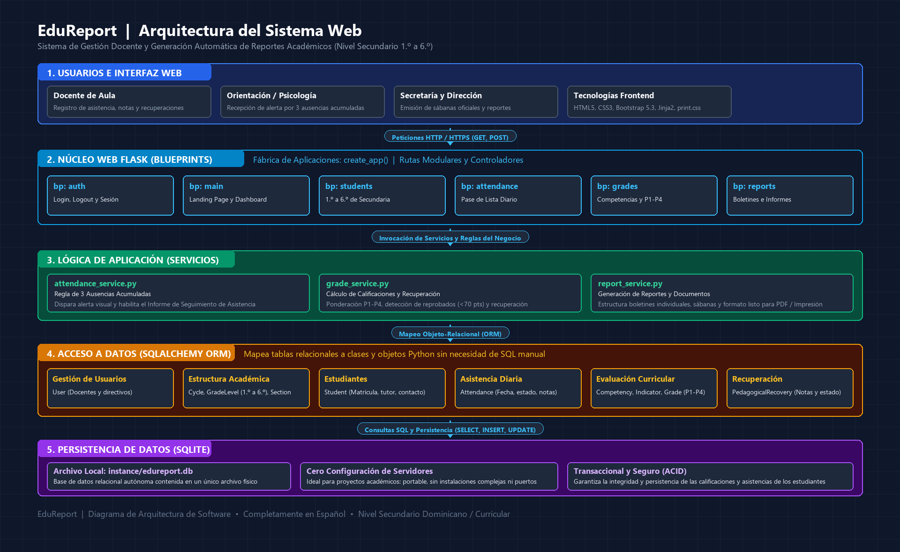

# 🏛️ Documento de Arquitectura de Software: EduReport
**Sistema de Gestión Docente y Generación Automática de Reportes Académicos**

---

## 📌 Introducción
Este documento detalla la **arquitectura del sistema EduReport**, diseñada para ser robusta, modular, escalable y, al mismo tiempo, **sencilla de comprender para estudiantes principiantes** en el desarrollo web con Python.

El objetivo de esta arquitectura es separar claramente las responsabilidades del sistema: la apariencia visual, la recepción de peticiones, las reglas pedagógicas del negocio y el almacenamiento permanente de los datos.

---

## 🖼️ Diagrama Visual de Arquitectura

A continuación se muestra el diagrama arquitectónico de componentes y flujo de datos de EduReport:



---

## 🧩 Representación de Componentes (Estilo Archify)

```
┌────────────────────────────────────────────────────────────────────────┐
│                        1. USUARIOS / ROLES                            │
│            [Docente]      [Orientación / Psicología]      [Secretaría] │
└───────────────────────────────────┬────────────────────────────────────┘
                                    │ Interactúa mediante el navegador
                                    ▼
┌────────────────────────────────────────────────────────────────────────┐
│                        2. INTERFAZ WEB (FRONTEND)                      │
│   • HTML5 Semántico (Estructura)        • Jinja2 (Motor de Plantillas) │
│   • CSS3 Personalizado (Estilos)        • Bootstrap 5.3 + Icons        │
│   • print.css (Estilos de Impresión / PDF)                             │
└───────────────────────────────────┬────────────────────────────────────┘
                                    │ Peticiones HTTP (GET / POST)
                                    ▼
┌────────────────────────────────────────────────────────────────────────┐
│                     3. NÚCLEO WEB (FLASK CORE)                         │
│   • run.py (Punto de Entrada)           • config.py (Configuraciones)  │
│   • create_app() (Application Factory)  • Extensiones inicializadas    │
└───────────────────────────────────┬────────────────────────────────────┘
                                    │ Enruta a Blueprints
                                    ▼
┌────────────────────────────────────────────────────────────────────────┐
│                         4. RUTAS (BLUEPRINTS)                          │
│   [bp_main]       [bp_auth]       [bp_students]   [bp_attendance]      │
│   Landing Page    Login/Logout    1.º a 6.º       Pase de lista        │
│                                                   [bp_grades & reports]│
└───────────────────────────────────┬────────────────────────────────────┘
                                    │ Ejecuta lógica de negocio
                                    ▼
┌────────────────────────────────────────────────────────────────────────┐
│                     5. LÓGICA DE APLICACIÓN (SERVICIOS)                │
│   • attendance_service: Regla de 3 Ausencias y disparador de alertas   │
│   • grade_service: Promedios P1-P4 y Recuperación Pedagógica (<70 pts) │
│   • report_service: Estructuración y preparación de reportes formales  │
└───────────────────────────────────┬────────────────────────────────────┘
                                    │ Mapeo de Objetos a Tablas
                                    ▼
┌────────────────────────────────────────────────────────────────────────┐
│                     6. CAPA ORM (FLASK-SQLALCHEMY)                     │
│   Modelos: User, Cycle, GradeLevel, Section, Student, Attendance,     │
│            Competency, Indicator, Grade, PedagogicalRecovery           │
└───────────────────────────────────┬────────────────────────────────────┘
                                    │ Consultas SQL (SELECT, INSERT...)
                                    ▼
┌────────────────────────────────────────────────────────────────────────┐
│                     7. PERSISTENCIA DE DATOS (SQLITE)                  │
│                     Archivo local: instance/edureport.db               │
└────────────────────────────────────────────────────────────────────────┘
```

---

## 1. Usuario
El **Usuario** es la persona humana que interactúa con la aplicación a través de un navegador web (en una computadora, tableta o teléfono).

En EduReport se contemplan principalmente tres roles pedagógicos:
1. **Docente de Aula:** Realiza el pase de lista diario, registra las calificaciones de cada período (P1, P2, P3, P4) y genera los reportes de sus secciones.
2. **Coordinador de Orientación y Psicología:** Supervisa el bienestar estudiantil y recibe de forma inmediata las alertas tempranas cuando un estudiante alcanza las **3 ausencias**, permitiendo una citación oportuna al tutor.
3. **Personal de Secretaría / Dirección:** Consulta las sábanas de notas consolidadas de 1.º a 6.º de Secundaria y archiva los boletines oficiales.

---

## 2. Interfaz Web (Frontend)
La **interfaz web** es todo lo que el usuario ve y con lo que interactúa en su pantalla. En EduReport está compuesta por cuatro elementos fundamentales:

- **HTML5:** Define la estructura y el contenido semántico de las páginas (títulos, tablas, formularios, botones).
- **CSS3 Personalizado (`style.css`):** Proporciona la identidad visual del proyecto, con una paleta de colores moderna, espaciados limpios y tipografía legible.
- **Bootstrap 5.3 + Bootstrap Icons:** Un conjunto de herramientas de diseño prediseñadas que asegura que la aplicación sea **responsiva** (se adapte a móviles y computadoras) y proporcione componentes elegantes como tarjetas de estadísticas, modales de confirmación y badges de alerta.
- **Jinja2 (Motor de Plantillas):** Es el traductor entre Python y el HTML. Permite escribir código como `` dentro del HTML para mostrar datos dinámicos generados por el servidor sin tener que duplicar archivos.

---

## 3. Flask (Framework Web)
**Flask** es el cerebro que coordina todo el funcionamiento de la aplicación en el servidor. 

En lugar de crear un único archivo gigante donde todo esté mezclado, EduReport utiliza el patrón profesional **Application Factory (Fábrica de Aplicaciones)**:
- Existe una función constructora llamada `create_app()`.
- Esta función lee la configuración del sistema (`config.py`), inicializa las herramientas necesarias (como la base de datos) y registra los diferentes módulos o departamentos de la aplicación.
- Este patrón es ideal para principiantes porque enseña a construir código desacoplado, fácil de probar y listo para crecer sin desorden.

---

## 4. Rutas (Controladores y Blueprints)
Una **ruta** es la dirección web o URL que el usuario escribe o visita en su navegador (por ejemplo: `/estudiantes`, `/asistencia/registrar` o `/login`).

Para mantener el proyecto ordenado, Flask utiliza el concepto de **Blueprints** (que podemos imaginar como "departamentos de una escuela"):
- **`main_routes`:** Administra la Landing Page pública y el Dashboard principal.
- **`auth_routes`:** Administra el inicio y cierre de sesión de los docentes.
- **`student_routes`:** Administra los estudiantes de Primer Ciclo (1.º, 2.º, 3.º) y Segundo Ciclo (4.º, 5.º, 6.º).
- **`attendance_routes`:** Maneja la toma de asistencia diaria y la bandeja de alertas.
- **`grade_routes`:** Maneja las calificaciones por competencias y la recuperación pedagógica.
- **`report_routes`:** Expone las vistas imprimibles de boletines y sábanas.

La función de cada ruta es sencilla: **recibir la petición del navegador, solicitar la información a la capa lógica y devolver la plantilla HTML correspondiente**.

---

## 5. Lógica de Aplicación (Servicios)
Un error muy común de los programadores novatos es colocar todas las operaciones matemáticas y reglas del colegio directamente dentro de los archivos de rutas. 

En EduReport separamos estas reglas en una carpeta llamada `app/services/`:
1. **`attendance_service.py`:**
   - Contabiliza las ausencias acumuladas de cada alumno.
   - **Regla de negocio principal:** Si `ausencias >= 3`, activa automáticamente el estado de alerta temprana y prepara los datos para emitir el *Informe de Seguimiento de Asistencia*.
2. **`grade_service.py`:**
   - Calcula los promedios de los períodos P1, P2, P3 y P4.
   - Evalúa si el estudiante alcanzó la nota mínima de aprobación (70 puntos). Si no la alcanza, habilita el flujo de **Recuperación Pedagógica** y calcula la calificación final ponderada.
3. **`report_service.py`:**
   - Agrupa los datos académicos del estudiante, materias e inasistencias en un formato estructurado y limpio para que los reportes se dibujen correctamente.

---

## 6. SQLAlchemy (ORM)
**SQLAlchemy** es una herramienta llamada **ORM (Object-Relational Mapping)** o *Mapeador Objeto-Relacional*.

### ¿Cómo se lo explicamos a un principiante?
Normalmente, para comunicarnos con una base de datos tendríamos que escribir sentencias en lenguaje SQL como:
```sql
SELECT * FROM students WHERE section_id = 2;
```
SQLAlchemy nos permite olvidarnos de escribir SQL manual propenso a errores y trabajar directamente con **clases y objetos de Python**:
```python
estudiantes = Student.query.filter_by(section_id=2).all()
```
Cada fila de una tabla de base de datos se convierte en un objeto común de Python (por ejemplo, `estudiante.first_name`), lo que hace que programar sea mucho más intuitivo, seguro contra ataques informáticos (como inyecciones SQL) y fácil de leer.

---

## 7. SQLite (Base de Datos)
**SQLite** es el motor de base de datos que guarda permanentemente toda la información de EduReport (estudiantes, notas, usuarios y faltas).

### ¿Por qué SQLite es la mejor opción para este proyecto?
1. **Sin configuración:** No requiere instalar servidores complejos como MySQL o PostgreSQL ni configurar puertos o contraseñas de red.
2. **Portabilidad total:** Toda la base de datos vive dentro de un único archivo (`edureport.db`). Si copias la carpeta del proyecto a otra computadora o a una memoria USB, ¡la base de datos viaja contigo!
3. **Estándar y confiable:** Cumple con todas las normas de integridad relacional (ACID), lo que garantiza que los datos de los estudiantes nunca se corrompan.

---

## 8. Generación de Reportes y Documentos Formatos Imprimibles / PDF
Una de las necesidades más críticas en el ámbito escolar es entregar documentos físicos formales: boletines oficiales, cartas de citación por ausencias y registros acumulados.

### Estrategia de EduReport:
En lugar de depender de librerías externas pesadas que requieren software compilado en C y suelen fallar en Windows, EduReport utiliza la estrategia moderna **HTML Print-Ready (`@media print`)**:
- Se diseñan plantillas HTML con tipografía formal, membrete institucional, tablas delimitadas y líneas de firmas de autoridades.
- Se utiliza una hoja de estilo especializada (`print.css`).
- Cuando el docente hace clic en **"Descargar / Imprimir Informe"**, la regla `@media print` se activa automáticamente:
  - Oculta barras de navegación, botones y menús laterales.
  - Ajusta los márgenes para páginas tamaño Carta (Letter) o A4.
  - Fuerza saltos de página inteligentes para que las tablas no se corten por la mitad.
- El docente puede seleccionar en su navegador **"Guardar como PDF"** o imprimir directamente en papel, logrando un resultado idéntico, limpio y universal en cualquier sistema operativo.

---

## 9. Estructura de Archivos del Proyecto
La siguiente estructura refleja la división ordenada de responsabilidades:

```text
EduReport/
│
├── .venv/                         # Entorno virtual aislado de Python (ignorado por Git)
├── .gitignore                     # Archivos que Git no debe rastrear (claves, db local, cache)
├── requirements.txt               # Lista de librerías necesarias (Flask, SQLAlchemy, etc.)
├── run.py                         # Archivo ejecutable que inicia el servidor de desarrollo
├── config.py                      # Configuraciones generales (rutas, base de datos, modo debug)
├── README.md                      # Explicación general del proyecto para GitHub
│
├── docs/                          # Documentación del sistema
│   ├── plan.md                    # Plan de trabajo aprobado
│   ├── arquitectura.md            # Este documento de arquitectura
│   ├── tutorial.md                # Tutorial de instalación y uso paso a paso
│   └── images/
│       └── arquitectura.png       # Diagrama gráfico de la arquitectura
│
└── app/                           # Paquete principal con el código fuente
    ├── __init__.py                # Fábrica create_app() e inicialización de librerías
    │
    ├── models/                    # Clases de la base de datos (SQLAlchemy)
    │   ├── user.py                # Docentes y administradores
    │   ├── academic.py            # Ciclos, Grados (1.º a 6.º), Secciones y Estudiantes
    │   ├── attendance.py          # Registro diario de asistencias
    │   └── evaluation.py          # Competencias, Indicadores, Calificaciones y Recuperación
    │
    ├── routes/                    # Puntos de acceso web (Blueprints)
    │   ├── main_routes.py         # Landing Page y Dashboard
    │   ├── auth_routes.py         # Login y Logout
    │   ├── student_routes.py      # Directorio de estudiantes
    │   ├── attendance_routes.py   # Pase de lista y alertas
    │   ├── grade_routes.py        # Registro de calificaciones y recuperación
    │   └── report_routes.py       # Vistas de reportes e impresión
    │
    ├── services/                  # Lógica matemática y pedagógica independiente
    │   ├── attendance_service.py  # Conteo de faltas y alerta de 3 ausencias
    │   ├── grade_service.py       # Ponderación P1-P4 y recuperación
    │   └── report_service.py      # Empaquetado de datos para impresión
    │
    ├── static/                    # Archivos públicos de diseño
    │   ├── css/
    │   │   ├── style.css          # Estilo general y paleta de colores
    │   │   └── print.css          # Reglas para impresión de reportes y PDFs
    │   ├── js/
    │   │   └── main.js            # Funciones interactivas del navegador
    │   └── img/
    │       └── logo.svg           # Logotipo institucional
    │
    └── templates/                 # Vistas HTML (Jinja2)
        ├── base.html              # Plantilla madre (menú, pie de página, estructura)
        ├── landing.html           # Página pública de bienvenida
        ├── auth/login.html        # Formulario de acceso
        ├── dashboard/index.html   # Panel con estadísticas y accesos directos
        ├── students/              # Vistas de alumnos
        ├── attendance/            # Vistas de pase de lista y alerta de faltas
        ├── grades/                # Vistas de notas y recuperación
        └── reports/               # Formatos formales de reportes
```

---

## 10. Flujo de Información (Ejemplo Paso a Paso)

Para comprender cómo colaboran todas estas piezas, analicemos el ciclo completo de la **Regla Específica de Negocio: Registro de la 3.ª Ausencia de un Estudiante**:

```
[1. Docente]
   │ Hace clic en "Guardar Asistencia" marcando la falta del alumno
   ▼
[2. Navegador Web]
   │ Envía una petición HTTP POST con los datos del formulario a /asistencia/registrar
   ▼
[3. Flask Core & Blueprint (attendance_routes.py)]
   │ La ruta recibe la petición, valida la sesión activa y llama al servicio
   ▼
[4. Servicio de Asistencia (attendance_service.py)]
   │ - Registra la inasistencia de hoy
   │ - Consulta a SQLAlchemy el total histórico de ausencias del estudiante
   ▼
[5. Capa ORM (SQLAlchemy) & SQLite (edureport.db)]
   │ Ejecuta la consulta y retorna: "El estudiante acumula exactamente 3 ausencias"
   ▼
[6. Activación de la Regla de Negocio]
   │ El servicio detecta la condición crítica (ausencias == 3):
   │ - Marca el estado del estudiante en "Alerta de Asistencia Activa"
   │ - Habilita el disparador para el "Informe de Seguimiento de Asistencia"
   ▼
[7. Respuesta al Navegador (Jinja2 Template)]
   │ Flask renderiza la vista de asistencia con un badge rojo de atención
   │ y un botón directo: [📄 Generar Informe de Seguimiento de Asistencia]
   ▼
[8. Impresión / Descarga]
   │ Si el docente pulsa el botón, report_routes carga el informe formal con las
   │ 3 fechas exactas y las líneas de firmas para Orientación y el Tutor,
   │ listo para imprimir o guardar como PDF mediante print.css.
```

---

## Conclusión Pedagógica
Esta arquitectura enseña al estudiante los principios fundamentales de la ingeniería de software moderna:
- **Separación de responsabilidades:** Cada archivo tiene un único propósito claro.
- **Escalabilidad:** Agregar una nueva función (como un nuevo tipo de reporte o cálculo) no requiere modificar el resto del sistema.
- **Seguridad y robustez:** El uso de ORM y sesiones protegidas previene errores comunes de desarrollo.
